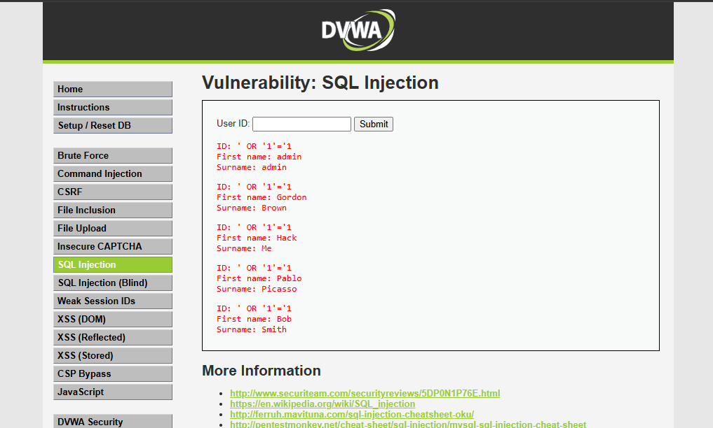

# Hallazgo 01: Inyección SQL (SQL Injection)

### 1. Evidencia del Ataque

### 2. Análisis Técnico
La vulnerabilidad se presenta en el formulario de consulta de datos del portal web de la municipalidad. El sistema toma la entrada del usuario directamente y la concatena en la consulta SQL sin sanitizar. El payload altera la estructura lógica transformando la condición en una sentencia siempre verdadera, lo que fuerza al motor de base de datos a retornar la totalidad de los registros de la tabla afectada.

### 3. Impacto en la Municipalidad de Cerro Verde
Al explotar este fallo en un buscador de patentes o multas, un atacante externo puede extraer la base de datos completa de los vecinos de la comuna. Esto expone RUTs, direcciones particulares, deudas financieras y correos electrónicos, violando la confidencialidad de los ciudadanos.

### 4. Gravedad CVSS 3.1
* Puntaje: 8.8 (High)
* Vector: CVSS:3.1/AV:N/AC:L/PR:N/UI:N/S:U/C:H/I:H/A:H

### 5. Controles y Defensas
* Prevención: Implementar consultas parametrizadas (Prepared Statements) con asignación estricta de tipos de datos, impidiendo que los valores de entrada sean interpretados por el intérprete SQL como comando ejecutable.
* Mitigación: Aplicar el principio de menor privilegio técnico a las credenciales de conexión de la app con la BD, bloqueando accesos administrativos innecesarios.