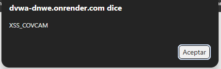

# Hallazgo 02: Cross-Site Scripting Reflejado (XSS)

### 1. Evidencia del Ataque

### 2. Análisis Técnico
La aplicación web refleja de manera directa los parámetros suministrados por el usuario en las respuestas HTML sin realizar codificación de salida. Esto causa que el navegador de la víctima confunda el texto de entrada con scripts del lado del cliente legítimos y los ejecute automáticamente en su contexto de navegación.

### 3. Impacto en la Municipalidad de Cerro Verde
Un atacante podría estructurar un enlace malicioso dirigido a los funcionarios municipales encargados de la aprobación de permisos y patentes. Si el funcionario hace clic, el script malicioso robaría sus tokens o cookies de sesión activos, permitiendo al atacante suplantar su identidad en la intranet interna de la municipalidad para aprobar patentes falsas o borrar multas.

### 4. Gravedad CVSS 3.1
* Puntaje: 6.1 (Medium)
* Vector: CVSS:3.1/AV:N/AC:L/PR:N/UI:R/S:C/C:L/I:L/A:N

### 5. Controles y Defensas
* Prevención: Aplicar codificación contextual en todas las salidas HTML (Output Encoding) transformando caracteres especiales como `<` en `&lt;`.
* Mitigación: Configurar cookies de sesión con las directivas HttpOnly y Secure, además de estructurar una Content Security Policy (CSP) robusta.